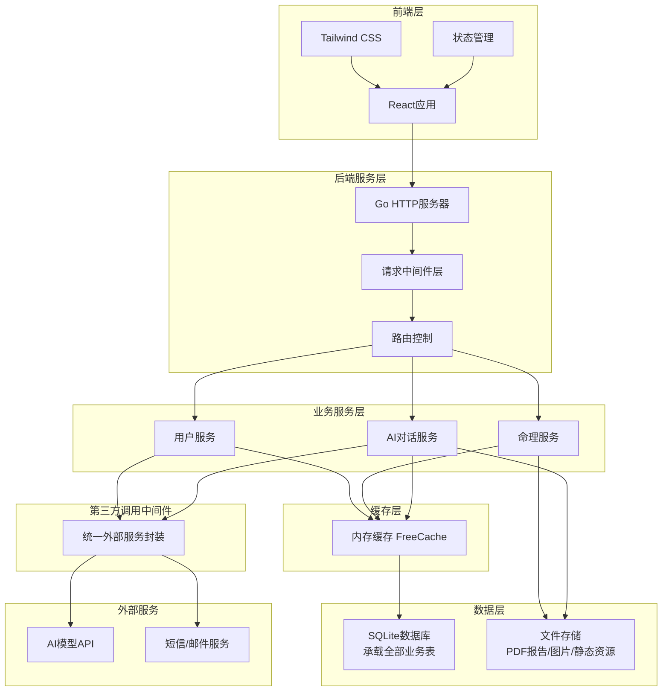
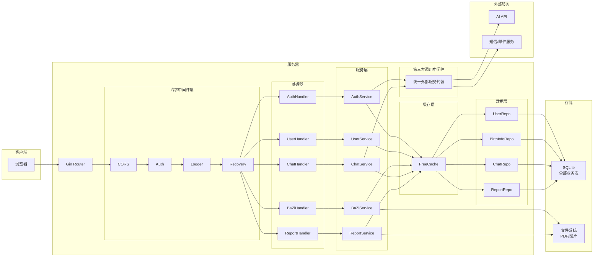
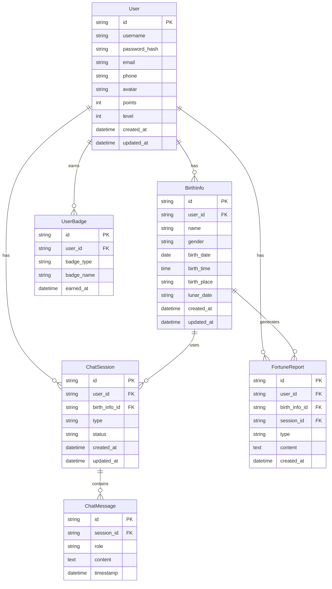

# 灵犀命理 - 技术架构文档

## 1. 架构设计



## 2. 技术栈说明

### 2.1 前端技术栈
- **框架**: React 18 + Vite
- **样式**: Tailwind CSS 3
- **状态管理**: React Context + useReducer
- **路由**: React Router v6
- **图表**: Recharts
- **动画**: Framer Motion
- **HTTP客户端**: Axios

### 2.2 后端技术栈
- **语言**: Go 1.21+
- **Web框架**: Gin
- **数据库**: SQLite (轻量化部署，承载用户、对话、命理、社区全部业务表)
- **ORM**: GORM
- **认证**: JWT
- **缓存**: FreeCache (内存缓存，缓存八字排盘、五行数据、AI对话上下文)
- **AI集成**: OpenAI API兼容接口
- **第三方调用中间件**: 统一封装AI、短信、邮件服务调用

### 2.3 开发工具
- **构建工具**: Vite
- **代码规范**: ESLint + Prettier
- **版本控制**: Git

## 3. 路由定义

### 3.1 前端路由

| 路由路径 | 页面名称 | 功能描述 |
|----------|----------|----------|
| `/` | 首页 | 平台介绍、功能导航 |
| `/birth-input` | 生辰录入页 | 生辰信息录入、八字排盘 |
| `/chat` | AI对话页 | 命理问答、实时对话 |
| `/report` | 命理报告页 | 完整报告展示、历史记录 |
| `/login` | 登录页 | 用户登录 |
| `/register` | 注册页 | 用户注册 |
| `/profile` | 用户中心 | 个人档案、积分勋章 |

### 3.2 后端API路由

| 路由路径 | 方法 | 功能描述 |
|----------|------|----------|
| `/api/auth/register` | POST | 用户注册 |
| `/api/auth/login` | POST | 用户登录 |
| `/api/auth/logout` | POST | 用户登出 |
| `/api/auth/refresh` | POST | 刷新Token |
| `/api/user/profile` | GET | 获取用户信息 |
| `/api/user/profile` | PUT | 更新用户信息 |
| `/api/birth-info` | POST | 保存生辰信息 |
| `/api/birth-info/:id` | GET | 获取生辰信息 |
| `/api/birth-info/list` | GET | 获取生辰信息列表 |
| `/api/bazi/calculate` | POST | 计算八字排盘 |
| `/api/bazi/analyze` | POST | 五行十神分析 |
| `/api/bazi/dayun` | POST | 大运流年推演 |
| `/api/chat/message` | POST | 发送AI对话消息 |
| `/api/chat/history/:sessionId` | GET | 获取对话历史 |
| `/api/chat/sessions` | GET | 获取对话会话列表 |
| `/api/report/generate` | POST | 生成命理报告 |
| `/api/report/:id` | GET | 获取报告详情 |
| `/api/report/list` | GET | 获取报告列表 |

## 4. API接口定义

### 4.1 用户认证相关

```typescript
// 用户注册请求
interface RegisterRequest {
  username: string;
  password: string;
  email?: string;
  phone?: string;
  verificationCode?: string;
}

// 用户登录请求
interface LoginRequest {
  username: string;
  password: string;
}

// 用户登录响应
interface LoginResponse {
  token: string;
  refreshToken: string;
  user: UserInfo;
}

// 用户信息
interface UserInfo {
  id: string;
  username: string;
  email?: string;
  phone?: string;
  avatar?: string;
  points: number;
  level: number;
  createdAt: string;
}
```

### 4.2 生辰信息相关

```typescript
// 生辰信息
interface BirthInfo {
  id: string;
  userId: string;
  name: string;
  gender: 'male' | 'female';
  birthDate: string; // 公历日期
  birthTime: string; // 出生时间
  birthPlace: string; // 出生地点
  lunarDate?: string; // 农历日期
  createdAt: string;
  updatedAt: string;
}

// 八字排盘结果
interface BaZiResult {
  yearPillar: string;   // 年柱
  monthPillar: string;  // 月柱
  dayPillar: string;    // 日柱
  hourPillar: string;  // 时柱
  fiveElements: {
    gold: number;
    wood: number;
    water: number;
    fire: number;
    earth: number;
  };
  tenGods: TenGodInfo[];
  dayMaster: string; // 日主
}

// 十神信息
interface TenGodInfo {
  name: string;
  pillar: string;
  strength: number;
  description: string;
}
```

### 4.3 AI对话相关

```typescript
// 对话消息
interface ChatMessage {
  id: string;
  sessionId: string;
  role: 'user' | 'assistant';
  content: string;
  timestamp: string;
}

// 发送消息请求
interface SendMessageRequest {
  sessionId?: string;
  birthInfoId: string;
  message: string;
  context?: string;
}

// 发送消息响应
interface SendMessageResponse {
  sessionId: string;
  message: ChatMessage;
  suggestions?: string[];
}
```

### 4.4 命理报告相关

```typescript
// 命理报告
interface FortuneReport {
  id: string;
  userId: string;
  birthInfoId: string;
  sessionId: string;
  type: 'basic' | 'complete' | 'career' | 'marriage' | 'wealth' | 'study' | 'health' | 'relationship';
  content: ReportContent;
  createdAt: string;
}

// 报告内容
interface ReportContent {
  summary: string;
  sections: ReportSection[];
  wuxing: WuxingAnalysis;
  dayun: DayunAnalysis;
}

// 报告章节
interface ReportSection {
  title: string;
  content: string;
  score?: number;
}

// 五行分析
interface WuxingAnalysis {
  distribution: { [key: string]: number };
  missing: string[];
  dominant: string[];
  suggestions: string[];
}

// 大运分析
interface DayunAnalysis {
  currentPeriod: string;
  periods: DayunPeriod[];
}

// 大运周期
interface DayunPeriod {
  ageRange: string;
  heavenlyStem: string;
  earthlyBranch: string;
  description: string;
  score: number;
}
```

### 4.5 用户勋章相关

```typescript
// 用户勋章
interface UserBadge {
  id: string;
  userId: string;
  badgeType: string;
  badgeName: string;
  badgeIcon: string;
  description: string;
  createdAt: string;
}
```

## 5. 服务器架构图



## 6. 数据模型

### 6.1 数据模型定义



### 6.2 数据库表结构 (DDL)

```sql
-- 用户表
CREATE TABLE users (
    id TEXT PRIMARY KEY,
    username TEXT UNIQUE NOT NULL,
    password_hash TEXT NOT NULL,
    email TEXT UNIQUE,
    phone TEXT UNIQUE,
    avatar TEXT,
    points INTEGER DEFAULT 0,
    level INTEGER DEFAULT 1,
    created_at DATETIME DEFAULT CURRENT_TIMESTAMP,
    updated_at DATETIME DEFAULT CURRENT_TIMESTAMP
);

-- 生辰信息表
CREATE TABLE birth_infos (
    id TEXT PRIMARY KEY,
    user_id TEXT NOT NULL,
    name TEXT NOT NULL,
    gender TEXT NOT NULL,
    birth_date DATE NOT NULL,
    birth_time TEXT NOT NULL,
    birth_place TEXT NOT NULL,
    lunar_date TEXT,
    created_at DATETIME DEFAULT CURRENT_TIMESTAMP,
    updated_at DATETIME DEFAULT CURRENT_TIMESTAMP,
    FOREIGN KEY (user_id) REFERENCES users(id)
);

-- 对话会话表
CREATE TABLE chat_sessions (
    id TEXT PRIMARY KEY,
    user_id TEXT NOT NULL,
    birth_info_id TEXT NOT NULL,
    type TEXT NOT NULL,
    status TEXT DEFAULT 'active',
    created_at DATETIME DEFAULT CURRENT_TIMESTAMP,
    updated_at DATETIME DEFAULT CURRENT_TIMESTAMP,
    FOREIGN KEY (user_id) REFERENCES users(id),
    FOREIGN KEY (birth_info_id) REFERENCES birth_infos(id)
);

-- 对话消息表
CREATE TABLE chat_messages (
    id TEXT PRIMARY KEY,
    session_id TEXT NOT NULL,
    role TEXT NOT NULL,
    content TEXT NOT NULL,
    timestamp DATETIME DEFAULT CURRENT_TIMESTAMP,
    FOREIGN KEY (session_id) REFERENCES chat_sessions(id)
);

-- 命理报告表
CREATE TABLE fortune_reports (
    id TEXT PRIMARY KEY,
    user_id TEXT NOT NULL,
    birth_info_id TEXT NOT NULL,
    session_id TEXT,
    type TEXT NOT NULL,
    content TEXT NOT NULL,
    created_at DATETIME DEFAULT CURRENT_TIMESTAMP,
    FOREIGN KEY (user_id) REFERENCES users(id),
    FOREIGN KEY (birth_info_id) REFERENCES birth_infos(id),
    FOREIGN KEY (session_id) REFERENCES chat_sessions(id)
);

-- 社区帖子表
CREATE TABLE community_posts (
    id TEXT PRIMARY KEY,
    user_id TEXT NOT NULL,
    title TEXT NOT NULL,
    content TEXT NOT NULL,
    tags TEXT,
    likes INTEGER DEFAULT 0,
    comments INTEGER DEFAULT 0,
    created_at DATETIME DEFAULT CURRENT_TIMESTAMP,
    updated_at DATETIME DEFAULT CURRENT_TIMESTAMP,
    FOREIGN KEY (user_id) REFERENCES users(id)
);

-- 帖子评论表
CREATE TABLE post_comments (
    id TEXT PRIMARY KEY,
    post_id TEXT NOT NULL,
    user_id TEXT NOT NULL,
    content TEXT NOT NULL,
    likes INTEGER DEFAULT 0,
    created_at DATETIME DEFAULT CURRENT_TIMESTAMP,
    FOREIGN KEY (post_id) REFERENCES community_posts(id),
    FOREIGN KEY (user_id) REFERENCES users(id)
);

-- 帖子点赞表
CREATE TABLE post_likes (
    id TEXT PRIMARY KEY,
    post_id TEXT NOT NULL,
    user_id TEXT NOT NULL,
    created_at DATETIME DEFAULT CURRENT_TIMESTAMP,
    FOREIGN KEY (post_id) REFERENCES community_posts(id),
    FOREIGN KEY (user_id) REFERENCES users(id),
    UNIQUE(post_id, user_id)
);

-- 用户勋章表
CREATE TABLE user_badges (
    id TEXT PRIMARY KEY,
    user_id TEXT NOT NULL,
    badge_type TEXT NOT NULL,
    badge_name TEXT NOT NULL,
    earned_at DATETIME DEFAULT CURRENT_TIMESTAMP,
    FOREIGN KEY (user_id) REFERENCES users(id)
);

-- 创建索引
CREATE INDEX idx_birth_infos_user_id ON birth_infos(user_id);
CREATE INDEX idx_chat_sessions_user_id ON chat_sessions(user_id);
CREATE INDEX idx_chat_messages_session_id ON chat_messages(session_id);
CREATE INDEX idx_fortune_reports_user_id ON fortune_reports(user_id);
CREATE INDEX idx_community_posts_user_id ON community_posts(user_id);
CREATE INDEX idx_post_comments_post_id ON post_comments(post_id);
CREATE INDEX idx_user_badges_user_id ON user_badges(user_id);
```

## 7. 项目目录结构

```
lingxi-fortune/
├── cmd/
│   └── api/
│       └── main.go              # 应用入口
├── internal/
│   ├── config/
│   │   └── config.go           # 配置管理
│   ├── handler/
│   │   ├── auth.go             # 认证处理器
│   │   ├── user.go             # 用户处理器
│   │   ├── bazi.go             # 八字处理器
│   │   ├── chat.go             # 对话处理器
│   │   ├── report.go           # 报告处理器
│   │   └── community.go        # 社区处理器
│   ├── middleware/
│   │   ├── request/            # 请求中间件层
│   │   │   ├── auth.go         # 认证中间件
│   │   │   ├── cors.go         # CORS中间件
│   │   │   ├── logger.go       # 日志中间件
│   │   │   └── recovery.go     # 恢复中间件
│   │   └── external/           # 第三方调用中间件
│   │       ├── adapter.go      # 统一外部服务封装
│   │       ├── ai.go           # AI服务封装
│   │       └── notification.go # 短信邮件封装
│   ├── model/
│   │   ├── user.go             # 用户模型
│   │   ├── birth_info.go       # 生辰信息模型
│   │   ├── chat.go             # 对话模型
│   │   ├── report.go           # 报告模型
│   │   └── community.go        # 社区模型
│   ├── repository/
│   │   ├── user.go             # 用户数据访问
│   │   ├── birth_info.go       # 生辰信息数据访问
│   │   ├── chat.go             # 对话数据访问
│   │   ├── report.go           # 报告数据访问
│   │   └── community.go        # 社区数据访问
│   ├── service/
│   │   ├── auth.go            # 认证服务
│   │   ├── user.go            # 用户服务
│   │   ├── bazi.go            # 八字服务
│   │   ├── chat.go            # 对话服务
│   │   ├── report.go          # 报告服务
│   │   └── community.go       # 社区服务
│   └── utils/
│       ├── jwt.go             # JWT工具
│       ├── response.go        # 响应工具
│       └── validator.go       # 验证工具
│       └── cache.go           # 缓存工具
├── pkg/
│   ├── bazi/
│   │   ├── calculator.go      # 八字计算
│   │   ├── wuxing.go          # 五行分析
│   │   ├── shishen.go         # 十神分析
│   │   └── dayun.go           # 大运推演
│   ├── cache/
│   │   └── freecache.go       # FreeCache封装
│   └── ai/
│       └── client.go          # AI客户端
├── web/
│   ├── src/
│   │   ├── components/        # React组件
│   │   ├── pages/             # 页面组件
│   │   ├── hooks/            # 自定义Hooks
│   │   ├── context/          # Context
│   │   ├── services/         # API服务
│   │   ├── utils/            # 工具函数
│   │   ├── styles/           # 样式文件
│   │   └── App.tsx           # 应用入口
│   ├── public/               # 静态资源
│   ├── index.html            # HTML模板
│   ├── package.json          # 依赖配置
│   ├── vite.config.ts        # Vite配置
│   └── tailwind.config.js    # Tailwind配置
├── data/
│   └── lingxi.db             # SQLite数据库(全部业务表)
├── storage/
│   ├── reports/              # PDF命理报告存储
│   ├── images/               # 用户上传图片
│   └── static/               # 静态资源文件
├── .env                      # 环境变量
├── go.mod                    # Go模块
├── go.sum                    # Go依赖
└── README.md                 # 项目说明
```

## 8. 核心算法

### 8.1 八字排盘算法

八字排盘是将公历日期转换为天干地支的过程：

1. **年柱计算**：根据立春时间确定年柱
2. **月柱计算**：根据节气确定月柱
3. **日柱计算**：使用万年历算法确定日柱
4. **时柱计算**：根据日柱和时辰推算时柱

### 8.2 五行分析算法

根据八字中的天干地支计算五行分布：

1. 统计天干地支中的五行属性
2. 计算五行强弱
3. 识别缺失五行
4. 分析五行平衡度

### 8.3 大运流年算法

根据性别和年柱阴阳推算大运：

1. 确定顺逆行（阳男阴女顺行，阴男阳女逆行）
2. 计算起运年龄
3. 推算各步大运
4. 分析流年运势

## 9. 安全设计

### 9.1 认证授权
- JWT Token认证
- Token刷新机制
- 密码加密存储（bcrypt）

### 9.2 数据安全
- HTTPS传输加密
- 敏感信息加密存储
- SQL注入防护
- XSS攻击防护

### 9.3 接口安全
- 请求频率限制
- 参数验证
- 错误信息脱敏

## 10. 性能优化

### 10.1 前端优化
- 代码分割
- 懒加载
- 图片压缩
- 缓存策略

### 10.2 后端优化
- 数据库索引
- 查询优化
- 缓存机制
- 连接池