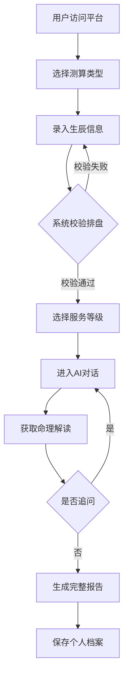
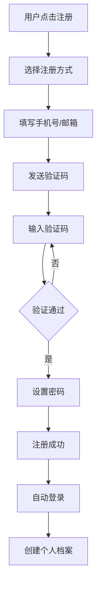

# 灵犀命理 - AI智能算命平台产品需求文档

## 1. 产品概述

灵犀命理是一款面向传统命理咨询需求用户的轻量化在线算命平台，依托大语言AI模型实现智能对话解读。以传统八字命理为核心载体，兼容生辰五行、十神、大运流年、姻缘事业财运多维度解析，摒弃固定模板化机械测算，采用拟人化AI实时对话交互形式输出专属命理内容。

**核心价值**：为用户提供个性化、智能化的命理咨询服务，满足从浅度好奇到深度咨询的多层次需求。

## 2. 核心功能

### 2.1 用户角色

| 角色 | 注册方式 | 核心权限 |
|------|----------|----------|
| 游客 | 无需注册 | 浏览首页、查看基础命理介绍、体验简批功能 |
| 普通用户 | 手机号/邮箱注册 | 完整命理解读、个人档案存储、社区交流、积分系统 |
| VIP用户 | 付费升级 | 深度详批、专属报告、优先AI响应、高级社区权限 |

### 2.2 功能模块

1. **生辰录入页**：生辰八字信息录入、校验、基础解析展示
2. **AI对话交互页**：智能命理问答、多维度解读、持续追问
3. **命理报告页**：完整命理报告展示、图文报告、时间轴记录
4. **用户中心页**：注册登录、个人档案、测算记录、积分勋章
5. **社区交流页**：运势心得分享、命理讨论、经验交流

### 2.3 页面详情

| 页面名称 | 模块名称 | 功能描述 |
|----------|----------|----------|
| 首页 | Hero区域 | 品牌展示、核心价值主张、快速开始入口 |
| 首页 | 功能导航 | 六大专项测算入口、分级服务介绍 |
| 生辰录入页 | 信息录入 | 姓名、性别、出生日期时间、出生地点 |
| 生辰录入页 | 八字校验 | 自动转换农历阳历、时辰校验、八字排盘预览 |
| 生辰录入页 | 服务选择 | 入门简批/完整详批/专项解读三级选择 |
| AI对话页 | 对话界面 | AI实时对话、命理解读输出、追问交互 |
| AI对话页 | 五行展示 | 五行分布可视化、十神关系图 |
| AI对话页 | 大运流年 | 大运流年时间轴、逐年运势推演 |
| 命理报告页 | 报告展示 | 完整命理报告、图文结合、可下载PDF |
| 命理报告页 | 时间轴 | 历史测算记录、不同阶段解读重点 |
| 用户中心 | 注册登录 | 手机号/邮箱注册、密码找回、第三方登录 |
| 用户中心 | 个人档案 | 生辰信息管理、测算记录、云端同步 |
| 用户中心 | 积分勋章 | 测算积分、成就勋章、连续咨询奖励 |
| 社区页 | 帖子列表 | 运势心得、命理讨论、经验分享 |
| 社区页 | 互动功能 | 点赞评论、关注用户、话题标签 |

## 3. 核心流程

### 3.1 用户测算流程

用户访问平台 → 选择测算类型 → 录入生辰信息 → 系统校验排盘 → 选择服务等级 → 进入AI对话 → 获取命理解读 → 持续追问深化 → 生成完整报告 → 保存个人档案

### 3.2 用户注册登录流程

用户点击注册 → 选择注册方式（手机号/邮箱） → 填写信息 → 验证码验证 → 设置密码 → 注册成功 → 自动登录 → 创建个人档案

## 4. 用户界面设计

### 4.1 设计风格

**主题风格**：东方古典与现代简约融合，营造神秘、专业、可信赖的氛围

**色彩方案**：
- 主色调：深紫色 (#5B4B8A) - 神秘、高贵
- 辅助色：金色 (#D4AF37) - 吉祥、财富
- 背景色：深色渐变 (#1A1A2E → #16213E) - 神秘氛围
- 文字色：浅金色 (#F5E6CC) - 古典韵味
- 强调色：朱红色 (#C73E1D) - 传统命理元素

**字体设计**：
- 标题字体：思源宋体 / Noto Serif SC - 古典韵味
- 正文字体：思源黑体 / Noto Sans SC - 清晰易读
- 装饰字体：霞鹜文楷 - 命理术语展示

**按钮风格**：
- 主要按钮：圆角矩形、渐变背景、微妙阴影
- 次要按钮：边框样式、半透明背景
- 交互效果：悬停发光、点击波纹

**布局风格**：
- 居中对齐、卡片式设计
- 左侧导航、右侧内容
- 顶部固定导航栏
- 响应式网格布局

**图标风格**：
- 线性图标、金色描边
- 命理元素图标（八卦、五行、天干地支）
- 微动画效果

### 4.2 页面设计概览

| 页面名称 | 模块名称 | UI元素 |
|----------|----------|--------|
| 首页 | Hero区域 | 全屏背景、星空粒子动画、居中标题、渐入动画 |
| 首页 | 功能导航 | 六宫格布局、图标+文字、悬停放大效果 |
| 生辰录入页 | 信息录入 | 卡片式表单、输入框发光效果、实时校验提示 |
| 生辰录入页 | 八字预览 | 八字排盘可视化、五行分布图、十神关系图 |
| AI对话页 | 对话界面 | 居中对话框、AI头像、打字机效果、消息气泡 |
| AI对话页 | 侧边栏 | 五行图表、大运流年时间轴、快捷问题 |
| 命理报告页 | 报告展示 | 卡片式布局、图文混排、章节导航、下载按钮 |
| 命理报告页 | 时间轴 | 左侧时间线、右侧内容卡片、悬停高亮 |
| 用户中心 | 个人信息 | 头像上传、信息编辑、安全设置 |
| 用户中心 | 积分勋章 | 积分进度条、勋章网格、成就列表 |
| 社区页 | 帖子列表 | 瀑布流布局、卡片式帖子、标签筛选 |
| 社区页 | 互动功能 | 点赞动画、评论框、分享按钮 |

### 4.3 响应式设计

- 桌面优先设计，适配移动端
- 断点：1200px（桌面）、768px（平板）、480px（手机）
- 移动端：底部导航、全屏对话、卡片堆叠
- 触摸优化：大按钮、滑动操作、手势支持

### 4.4 动效设计

- 页面加载：渐入动画、元素依次出现
- 页面切换：淡入淡出、滑动过渡
- 交互反馈：按钮点击波纹、悬停发光
- 数据可视化：图表动画、数字滚动
- AI对话：打字机效果、思考动画

## 5. 六大核心业务能力详解

### 5.1 分层分级命理解读体系

**入门基础简批**：
- 五行属性分析
- 基础性格特质
- 近期运势概览
- 免费体验服务

**完整人生全维度详批**：
- 完整八字排盘
- 五行十神详解
- 大运流年分析
- 六大专项深度解读
- 专属命理报告

**专项定向解读**：
- 事业发展：职业方向、贵人方位、事业运势
- 婚姻姻缘：正缘特征、婚运时机、感情走向
- 财运走势：财源方位、投资运势、财富时机
- 学业前程：学业运势、考试运、发展方向
- 健康福运：健康注意、养生建议、福运提升
- 人际贵人：贵人特征、人际运势、社交建议

### 5.2 全链路AI互动式命理问答

**核心功能**：
- 精准生辰八字信息录入校验
- 五行十神基础解析
- 大运流年逐年推演
- 针对性人生困惑AI问答

**交互特点**：
- 支持持续追问细化解读
- 反向提问化解疑虑
- AI实时调整回答逻辑
- 个性化命理建议

### 5.3 可视化命理测算进度与记录追踪

**功能特点**：
- 自动保存生辰基础信息
- 历史测算对话记录
- 完整命理解读报告
- 个人专属命理档案
- 时间轴展示
- 图文报告留存

### 5.4 完整用户注册登录体系

**注册方式**：
- 手机号注册（验证码）
- 邮箱注册（验证链接）
- 第三方登录（微信、QQ）

**核心功能**：
- 账号密码找回
- 个人生辰档案云端存储
- 多设备同步
- 测算记录保存
- AI对话历史

### 5.5 AI驱动个性化命理解读路径推荐

**智能推荐机制**：
- 根据生辰八字自动分析
- 首次提问关注方向识别
- 持续追问核心诉求分析
- 动态调整解读侧重点
- 优先输出用户关心内容
- 拒绝千篇一律模板解读

### 5.6 命理交流社区与测算成就激励系统

**社区功能**：
- 运势心得分享
- 命理常识讨论
- 测算经验交流
- 话题标签分类
- 点赞评论互动

**激励系统**：
- 专属命理勋章
- 测算积分体系
- 连续咨询成就
- 限定图文报告解锁
- 专项运势推演素材